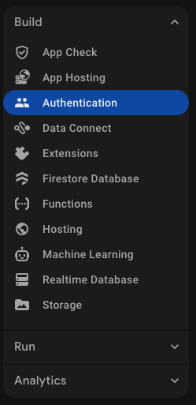
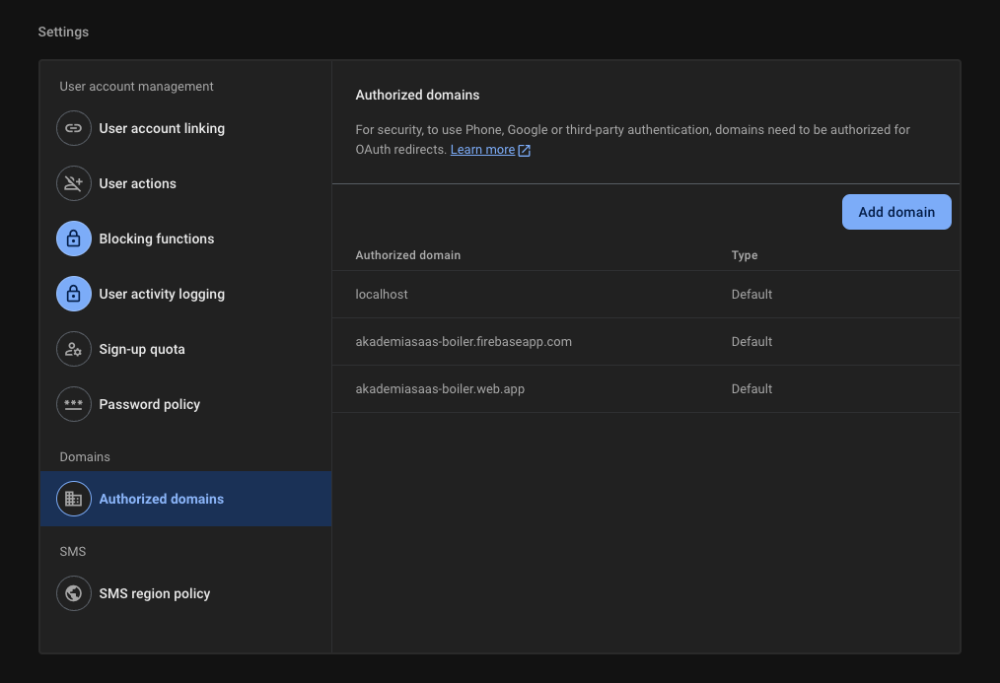
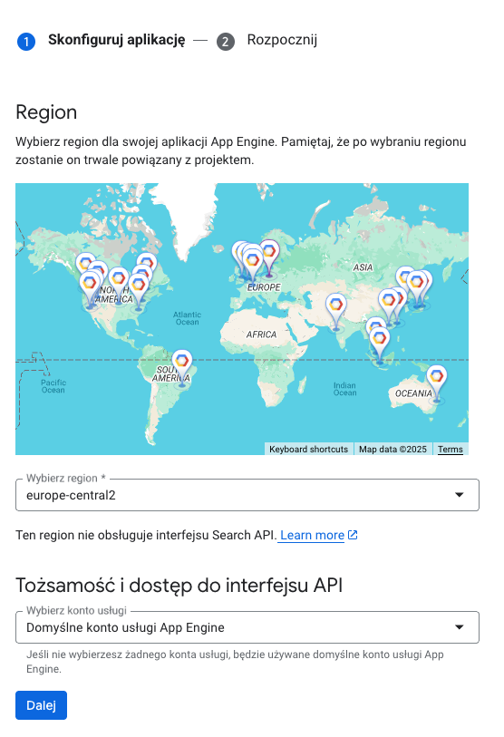

# Konfiguracja usług Firebase

## Spis treści
- [Wymagania wstępne](#wymagania-wstępne)
- [Authentication](#authentication)
- [Firestore](#firestore)
- [Storage](#storage)
- [Hosting](#hosting)
- [Cloud Functions](#cloud-functions)

## Wymagania wstępne

1. Upewnij się, że masz skonfigurowane środowisko zgodnie z dokumentem [Konfiguracja środowiska deweloperskiego](./02-dev-environment-setup.md)
2. Upewnij się, że masz utworzony projekt Firebase i zaktualizowany plik `.firebaserc`

> **Uwaga**: W interfejsie Firebase Console wszystkie usługi (Authentication, Firestore, Storage, etc.) mogą być ukryte pod sekcją "Build" w lewym menu:
>
> 

## Authentication

1. W Firebase Console przejdź do Authentication
2. Kliknij "Get Started"
3. W zakładce "Sign-in method" włącz następujące metody logowania:
   - Email/Password
     - Włącz opcję "Email/Password"
     - Włącz opcję "Email link (passwordless sign-in)"
4. Dodaj domenę do autoryzowanych domen (dla środowiska produkcyjnego)



## Firestore

1. W Firebase Console przejdź do Firestore Database
2. Kliknij "Create database"
3. Wybierz lokalizację (np. `europe-central2` dla Warszawy)
4. Wybierz "Start in production mode"
5. Poczekaj na utworzenie bazy danych
6. Reguły bezpieczeństwa są konfigurowane w pliku `firestore.rules`

## Storage

1. W Firebase Console przejdź do Storage
2. Jeśli pojawi się komunikat "To use Storage, upgrade your project's billing plan", kliknij przycisk "Upgrade project"
   - Plan Blaze (Pay as you go) jest wymagany dla usługi Storage
   - Nie martw się o koszty - Firebase oferuje hojny darmowy tier, a płacisz tylko za wykorzystane zasoby powyżej limitu
   - Po kliknięciu przycisku "Upgrade project" zostaniesz poproszony o wybór lub utworzenie konta rozliczeniowego Google Cloud:
     - Jeśli masz już konto rozliczeniowe, wybierz je z listy "Available Cloud Billing accounts"
     - Jeśli nie masz jeszcze konta rozliczeniowego, kliknij "Create a Cloud Billing account" i postępuj zgodnie z instrukcjami, aby podać dane karty płatniczej i informacje rozliczeniowe
     - Karta przejdzie proces weryfikacji w celu potwierdzenia jej ważności
3. Po pomyślnej aktywacji planu Blaze, kliknij "Get Started"
4. Wybór lokalizacji dla Storage:
   - Możesz wybrać inną lokalizację niż dla Firestore - nie ma technicznego wymogu, aby obie usługi były w tym samym regionie
   - Z darmowych opcji dostępne są lokalizacje w USA: us-central1, us-east1, us-west1
   - Dla użytkowników z Polski/Europy najlepszym wyborem będzie us-east1 (Moncks Corner, Południowa Karolina), ponieważ ma najniższe opóźnienie dla ruchu z Europy
   - Pamiętaj, że wybór lokalizacji bliższej Twoim użytkownikom końcowym może poprawić wydajność aplikacji
   - Jeśli potrzebujesz lokalizacji w Europie (np. europe-west3 lub europe-central2), może wiązać się to z kosztami przechowywania danych od samego początku
5. Wybierz "Start in production mode"
6. Reguły bezpieczeństwa są konfigurowane w pliku `storage.rules`

## Hosting

1. W Firebase Console przejdź do Hosting
2. Kliknij "Get Started"
3. Możesz pominąć sugerowane komendy instalacyjne i konfiguracyjne - wrócimy do nich w dalszej części dokumentacji
4. Kliknij "Next", aby przejść dalej
5. W tej sekcji możesz również skonfigurować własną domenę dla swojej aplikacji (Add custom domain)

## Cloud Functions

1. W Firebase Console przejdź do Functions
2. Kliknij "Get Started"
3. Możesz pominąć sugerowane komendy instalacyjne i konfiguracyjne - wrócimy do nich w dalszej części dokumentacji
4. Konfiguracja jest już zawarta w katalogu `apps/functions`
5. **Ważne**: Cloud Functions wymaga utworzenia instancji Google App Engine w tym samym regionie:
   - Przejdź do [Google Cloud Console](https://console.cloud.google.com/appengine)
   - Wybierz ten sam projekt, który używasz dla Firebase
   - Kliknij "Create Application"
   - Wybierz odpowiedni region dla twoich funkcji (np. `europe-central2` dla Europy Środkowej)
   - Możesz zostać poproszony o wybór konta usługi dla App Engine (Tożsamość i dostęp do interfejsu API). W takim przypadku wybierz domyślne konto usługi App Engine:

   

   - Zakończ kreator konfiguracji. Możesz pominąć etap konfiguracji środowiska i języka programowania.

## Weryfikacja konfiguracji

1. Sprawdź status usług w Firebase Console:
```bash
firebase projects:list
```

2. Upewnij się, że projekt jest poprawnie wybrany:
```bash
firebase use develop
```

## Potencjalne problemy i rozwiązania

### Problem z uprawnieniami
- Upewnij się, że masz rolę Owner lub Editor w projekcie
- Sprawdź, czy wszystkie wymagane API są włączone
- Sprawdź, czy plan Blaze jest aktywny dla usług Storage i Cloud Functions

### Problem z konfiguracją Storage i rolą IAM {#problem-z-konfiguracja-storage-i-rola-iam}
- Podczas pierwszego wdrożenia możesz zostać poproszony o potwierdzenie utworzenia roli IAM: `Cloud Storage for Firebase needs an IAM Role to use cross-service rules. Grant the new role? (Y/n)`
- Wprowadź `Y` i naciśnij Enter, aby zatwierdzić utworzenie roli
- Jest to jednorazowa operacja wymagana do prawidłowego działania reguł Storage

### Problem z wdrażaniem Cloud Functions
- Jeśli pojawia się błąd związany z brakiem instancji Google App Engine, upewnij się, że utworzyłeś aplikację App Engine zgodnie z krokiem 5 w sekcji "Cloud Functions"
- Sprawdź, czy region App Engine jest zgodny z regionem, który wybrałeś podczas wdrażania funkcji

### Problem z regułami bezpieczeństwa
- Sprawdź składnię reguł w plikach `firestore.rules` i `storage.rules`
- Użyj Firebase Emulator do testowania reguł lokalnie

## Przydatne linki
- [Firebase Authentication](https://firebase.google.com/docs/auth)
- [Firestore Security Rules](https://firebase.google.com/docs/firestore/security/get-started)
- [Storage Security Rules](https://firebase.google.com/docs/storage/security)
- [Firebase Hosting](https://firebase.google.com/docs/hosting)
- [Cloud Functions](https://firebase.google.com/docs/functions)
