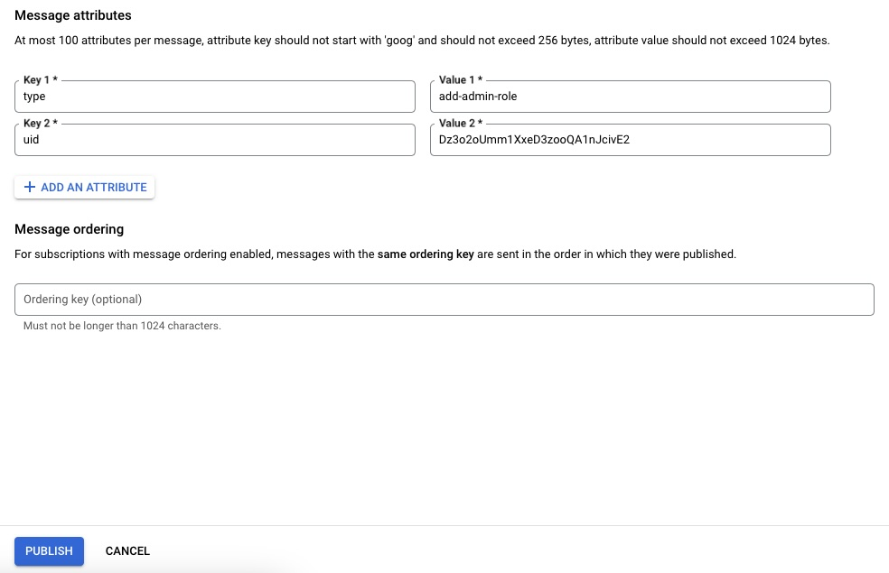

# Zarządzanie użytkownikami

## Spis treści
- [Wprowadzenie](#wprowadzenie)
- [Role użytkowników](#role-użytkowników)
- [Nadawanie uprawnień administratora](#nadawanie-uprawnień-administratora)
- [Zarządzanie kontami użytkowników](#zarządzanie-kontami-użytkowników)
- [Przydatne linki](#przydatne-linki)

## Wprowadzenie

Dokument ten opisuje proces zarządzania użytkownikami w aplikacji, w tym tworzenie kont, przypisywanie ról i zarządzanie uprawnieniami. System zarządzania użytkownikami bazuje na mechanizmach Firebase Authentication oraz dodatkowej logice przechowywania ról w Firestore.

## Role użytkowników

W aplikacji dostępne są następujące role użytkowników:

1. **Użytkownik standardowy** - Domyślna rola przypisywana wszystkim nowo zarejestrowanym użytkownikom
2. **Administrator** - Rola z rozszerzonymi uprawnieniami do zarządzania aplikacją

Każda rola ma dostęp do różnych funkcjonalności, które są kontrolowane przez Security Rules w Firebase oraz logikę aplikacji.

## Nadawanie uprawnień administratora

Aby nadać użytkownikowi uprawnienia administratora:

1. Zidentyfikuj UID użytkownika, którego chcesz uczynić administratorem
2. Przejdź do Google Cloud Console -> Pub/Sub -> Topics
3. Znajdź temat administratora (skonfigurowany w `env.pubsub.admin`)
4. Kliknij "Publish message"
5. Dodaj następujące atrybuty:
   - Klucz: `type`, Wartość: `add-admin-role`
   - Klucz: `uid`, Wartość: `UID_UŻYTKOWNIKA`
6. Kliknij "Publish"

Użytkownik natychmiast otrzyma uprawnienia administratora. Aby zobaczyć funkcje administracyjne, użytkownik musi wylogować się i zalogować ponownie.

## Zarządzanie kontami użytkowników

### Tworzenie kont użytkowników

Nowe konta użytkowników mogą być tworzone poprzez:
1. Rejestrację standardową (email/hasło)
2. Logowanie z wykorzystaniem dostawców zewnętrznych (Google, Facebook, itp.)

### Blokowanie kont użytkowników

Jako administrator, możesz blokować konta użytkowników przez:
1. Przejście do Firebase Console -> Authentication
2. Znalezienie użytkownika na liście
3. Kliknięcie "Disable account"

### Usuwanie kont użytkowników

Usunięcie konta użytkownika:
1. Przejdź do Firebase Console -> Authentication
2. Znajdź użytkownika na liście
3. Kliknij na trzy kropki obok użytkownika, a następnie wybierz "Delete account"

**Ważne**: Usunięcie konta w Firebase Authentication nie usuwa automatycznie danych użytkownika z Firestore. Należy dodatkowo:

1. Przejść do Firebase Console -> Firestore Database
2. Odnaleźć kolekcję `/users`
3. Zidentyfikować i usunąć dokument użytkownika (dokument ma ID identyczne z UID użytkownika w Authentication)

Alternatywnie:
- Zaleca się implementację funkcji Cloud Functions, która będzie monitorować zdarzenia usuwania kont i automatycznie czyścić powiązane dane w Firestore
- Można również utworzyć dedykowany panel administracyjny, który ułatwi zarządzanie użytkownikami i zapewni jednoczesne usuwanie kont i danych

Nieusunięcie danych z Firestore może prowadzić do problemów z integracją, rozliczaniem, a także do naruszenia przepisów o ochronie danych osobowych.

## Przydatne linki

- [Dokumentacja Firebase Authentication](https://firebase.google.com/docs/auth)
- [Zarządzanie użytkownikami w Firebase](https://firebase.google.com/docs/auth/admin/manage-users)
- [Pub/Sub w Google Cloud](https://cloud.google.com/pubsub/docs/overview)
