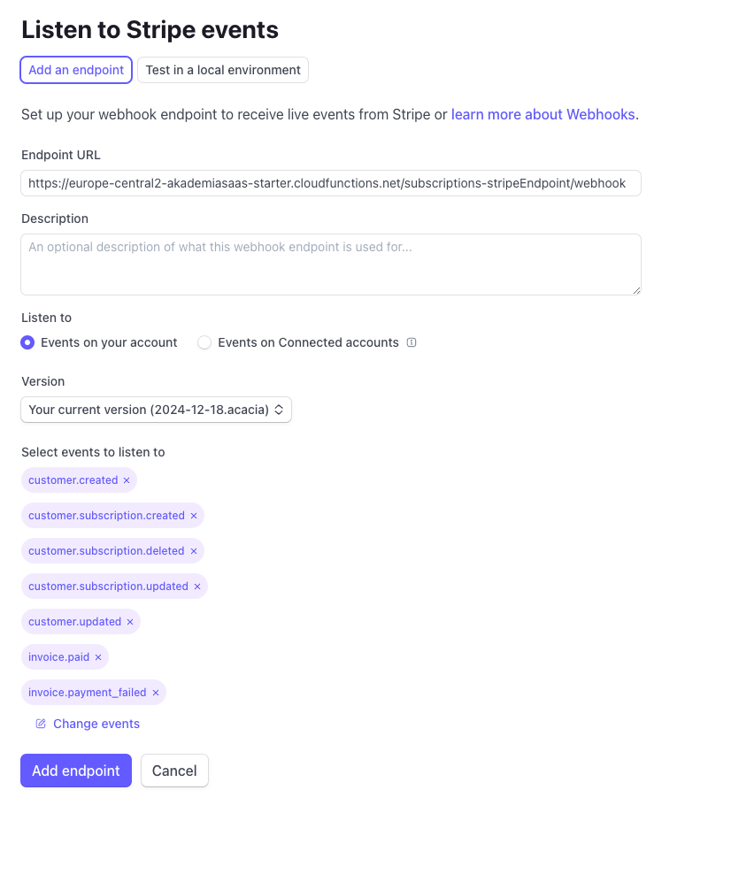

# Integracja z systemem płatności Stripe

## Spis treści
- [Wprowadzenie](#wprowadzenie)
- [Wymagania wstępne](#wymagania-wstępne)
- [Dostęp do panelu Stripe](#dostęp-do-panelu-stripe)
- [Konfiguracja klucza API](#konfiguracja-klucza-api)
- [Konfiguracja portalu klienta](#konfiguracja-portalu-klienta)
- [Konfiguracja webhooka](#konfiguracja-webhooka)
- [Tworzenie planów subskrypcji](#tworzenie-planów-subskrypcji)
- [Konfiguracja kluczy wyszukiwania](#konfiguracja-kluczy-wyszukiwania)
- [Włączenie Stripe Tax](#włączenie-stripe-tax)
- [Testowanie integracji](#testowanie-integracji)
- [Przydatne linki](#przydatne-linki)

## Wprowadzenie

Dokument ten opisuje proces integracji aplikacji z systemem płatności Stripe, który jest wykorzystywany do obsługi subskrypcji i płatności w aplikacji. Integracja obejmuje konfigurację API, webhooków, planów subskrypcji oraz inne niezbędne elementy do prawidłowego działania systemu płatności.

## Wymagania wstępne

Przed rozpoczęciem integracji z Stripe, upewnij się, że:
1. Posiadasz konto w Stripe (możesz utworzyć darmowe konto testowe)
2. Zainstalowane są wszystkie niezbędne pakiety w projekcie
3. Zmienne środowiskowe są prawidłowo skonfigurowane (zgodnie z [dokumentacją zmiennych środowiskowych](./06-environment-variables.md))

## Dostęp do panelu Stripe

Panel deweloperski Stripe jest dostępny z lewego dolnego rogu menu w interfejsie Stripe Dashboard. Zapewnia on dostęp do kluczy API, konfiguracji webhooków, zarządzania produktami i subskrypcjami oraz innych funkcji.

## Konfiguracja klucza API

1. Przejdź do Stripe -> Developers -> API keys
2. Znajdź sekcję "Standard keys" i zlokalizuj swój Secret key
3. Ustaw `STRIPE_API_KEY` w pliku `.env.develop` używając tajnego klucza API w trybie testowym:
   ```
   STRIPE_API_KEY=sk_test_your_secret_key
   ```

> **Uwaga**: Nigdy nie udostępniaj tajnych kluczy API ani nie przechowuj ich w systemie kontroli wersji.

## Konfiguracja portalu klienta

Stripe Customer Portal umożliwia użytkownikom samodzielne zarządzanie subskrypcjami i metodami płatności:

1. Przejdź do Stripe -> Billing -> Customer Portal
2. Włącz metody płatności, które chcesz obsługiwać
3. Skonfiguruj dodatkowe ustawienia portalu na stronie https://dashboard.stripe.com/test/settings/billing/portal

## Konfiguracja webhooka

Webhooks umożliwiają synchronizację stanu płatności między Stripe a twoją aplikacją:

1. Przejdź do Stripe -> Developers -> Webhooks
2. Kliknij przycisk "Add endpoint"
3. Dodaj webhook dla zdarzeń, wskazując na endpoint `subscriptions-stripeEndpoint/webhook` (skopiuj URL triggera z funkcji Cloud Run)
4. Skonfiguruj następujące zdarzenia webhooka:
   - `customer.created`
   - `customer.subscription.created`
   - `customer.subscription.deleted`
   - `customer.subscription.updated`
   - `customer.updated`
   - `invoice.paid`
   - `invoice.payment_failed`

   

5. Po utworzeniu webhooka, Stripe wygeneruje sekret, który będzie używany do weryfikacji podpisów
6. Ustaw `STRIPE_WEBHOOK_SECRET` w pliku `.env.develop`:
   ```
   STRIPE_WEBHOOK_SECRET=whsec_your_webhook_secret
   ```

## Tworzenie planów subskrypcji

W Stripe należy utworzyć produkty i plany cenowe odpowiadające twoim planom subskrypcji:

1. Przejdź do Stripe -> Products
2. Kliknij "Add product"
3. Utwórz produkt odpowiadający twojej ofercie
4. Dla produktu utwórz plany cenowe (Basic, Standard, Professional)
5. Ustaw `STRIPE_PRODUCT_ID` w pliku `.env.develop`:
   ```
   STRIPE_PRODUCT_ID=prod_your_product_id
   ```

## Konfiguracja kluczy wyszukiwania

Klucze wyszukiwania (lookup keys) to specjalny atrybut w API Stripe, który umożliwia łatwą identyfikację i wyszukiwanie planów cenowych bez konieczności używania identyfikatorów:

1. Przejdź do panelu Stripe -> Products -> Twój produkt
2. Znajdź plan cenowy, który chcesz skonfigurować i kliknij na niego
3. Przewiń do sekcji "Advanced"
4. W polu "Lookup key" wprowadź odpowiednią wartość klucza wyszukiwania, np.:
   - pl-month-basic
   - intl-month-basic
   - pl-month-standard
   - intl-month-standard
   - pl-month-professional
   - intl-month-professional
5. Kliknij "Update" aby zapisać zmiany

> **Uwaga**: Lookup keys ułatwiają zarządzanie i wyszukiwanie cen bez konieczności zapamiętywania ich identyfikatorów. Każdy klucz musi być unikalny w obrębie całego konta Stripe.

> **Uwaga**: Plik `packages/shared/src/models/documents/Subscriptions.ts` zawiera definicje planów subskrypcji używanych w aplikacji. Edytuj ten plik tylko wtedy, gdy potrzebujesz wprowadzić własne formaty lub struktury subskrypcji.

## Włączenie Stripe Tax

Włączenie Stripe Tax jest konieczne dla poprawnego działania systemu subskrypcji i prawidłowego naliczania podatków:

1. Przejdź do https://dashboard.stripe.com/test/tax/overview
2. Kliknij "Set up Stripe Tax" i postępuj zgodnie z instrukcjami

Po włączeniu Stripe Tax, system automatycznie obliczy, doda i rozliczy podatki dla wszystkich transakcji, zgodnie z obowiązującymi przepisami w danej lokalizacji klienta.

## Testowanie integracji

Aby przetestować integrację z Stripe:

1. Użyj testowych numerów kart kredytowych dostarczanych przez Stripe:
   - Udana płatność: 4242 4242 4242 4242
   - Nieudana płatność: 4000 0000 0000 0002
2. Sprawdź logi funkcji Cloud, aby upewnić się, że webhooks są prawidłowo przetwarzane
3. Sprawdź panel Stripe, aby potwierdzić, że subskrypcje są tworzone prawidłowo

## Przydatne linki

- [Dokumentacja Stripe](https://stripe.com/docs)
- [Testy płatności Stripe](https://stripe.com/docs/testing)
- [Integracja Stripe z Firebase](https://firebase.google.com/docs/extensions/official/firestore-stripe-subscriptions)
- [Zarządzanie subskrypcjami Stripe](https://stripe.com/docs/billing/subscriptions/overview)
